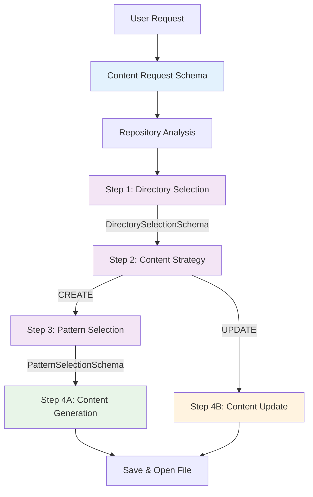

# Sequential Orchestration with Deterministic Schemas

## 🎯 **Architecture Overview**

The extension now uses a **sequential orchestration pattern** where each decision is a separate prompt to Copilot with deterministic JSON schemas for input and output.

## 📋 **Workflow Steps**

### **Step 0: Content Request Organization**
```typescript
interface ContentRequestSchema {
  goal: string;
  audience: string;
  contentType: string;
  inputMaterials: Array<{
    source: string;
    type: string;
    preview: string;
  }>;
  timestamp: string;
}
```

### **Step 1: Directory Selection**
- **Prompt**: `orchestration/01-directory-selection.md`
- **Input**: Content request + Repository analysis
- **Output Schema**:
```typescript
interface DirectorySelectionSchema {
  selectedDirectory: string;
  reasoning: string;
  confidence: number;
  existingFiles: string[];
  directoryPurpose: string;
  alternativeOptions: Array<{
    directory: string;
    reason: string;
  }>;
}
```

### **Step 2: Content Strategy (CREATE vs UPDATE)**
- **Prompt**: `orchestration/02-content-strategy.md`
- **Input**: Previous output + Directory contents
- **Output Schema**:
```typescript
interface ContentStrategySchema {
  action: 'CREATE' | 'UPDATE';
  targetFile?: string; // Required if UPDATE
  reasoning: string;
  contentOverlap: number;
  existingContentSummary?: string;
  userJourneyContext: string;
}
```

### **Step 3A: Pattern Selection (if CREATE)**
- **Prompt**: `orchestration/03-pattern-selection.md`
- **Input**: Content request + Selected directory
- **Output Schema**:
```typescript
interface PatternSelectionSchema {
  patternId: string;
  patternName: string;
  reasoning: string;
  requiredSections: string[];
  audienceAlignment: string;
  alternativePatterns: Array<{
    patternId: string;
    reason: string;
  }>;
}
```

### **Step 4: Content Generation**
- **Prompt**: `orchestration/04-content-generation.md` (CREATE)
- **Prompt**: `orchestration/05-content-update.md` (UPDATE)
- **Input**: All previous decisions + Source materials
- **Output Schema**:
```typescript
interface ContentGenerationSchema {
  content: string;
  title: string;
  filename: string;
  frontMatter: Record<string, string>;
  sections: Array<{
    heading: string;
    content: string;
  }>;
  metadata: {
    wordCount: number;
    readingTime: number;
    technicalLevel: string;
  };
}
```

## 🔄 **Data Flow**



## 🎨 **Key Design Principles**

### **1. Deterministic Schemas**
- Every step has a well-defined input and output schema
- No heuristic parsing of free-form text
- Copilot is instructed to return ONLY valid JSON

### **2. Sequential Decision Making**
- Each step builds on the previous one
- Output from one step becomes input for the next
- Clear chain of reasoning throughout

### **3. Separation of Concerns**
- **Models**: Define all schemas (`OrchestrationModels.ts`)
- **Prompts**: Contain instructions for Copilot (`prompts/orchestration/`)
- **Service**: Only handles orchestration logic (`SequentialOrchestrationService.ts`)

### **4. Error Handling**
- Each step returns a `WorkflowStepResult<T>` with success/error states
- Failed steps stop the workflow with clear error messages
- All prompts and responses are logged for debugging

## 📁 **File Structure**

```
src/
├── models/
│   └── OrchestrationModels.ts    # All schemas
├── prompts/
│   └── orchestration/
│       ├── 01-directory-selection.md
│       ├── 02-content-strategy.md
│       ├── 03-pattern-selection.md
│       ├── 04-content-generation.md
│       └── 05-content-update.md
└── services/
    └── SequentialOrchestrationService.ts
```

## 🚀 **Benefits**

### **1. Predictable Behavior**
- Deterministic schemas ensure consistent outputs
- No guessing or pattern matching required
- Clear contract between steps

### **2. Debuggable**
- Each step's input/output is logged
- Failed steps provide clear error context
- Easy to identify where issues occur

### **3. Maintainable**
- Prompts are separate from code
- Schemas are centralized
- Service logic is minimal and focused

### **4. Extensible**
- Easy to add new steps
- Simple to modify schemas
- Prompts can be updated without code changes

## 📊 **Workflow Result Structure**

```typescript
interface OrchestrationResult {
  success: boolean;
  filePath?: string;
  action: 'CREATED' | 'UPDATED';
  steps: {
    directorySelection?: WorkflowStepResult<DirectorySelectionSchema>;
    contentStrategy?: WorkflowStepResult<ContentStrategySchema>;
    patternSelection?: WorkflowStepResult<PatternSelectionSchema>;
    contentGeneration?: WorkflowStepResult<ContentGenerationSchema>;
  };
  error?: string;
}
```

Each step result includes:
- `success`: Whether the step completed successfully
- `data`: The structured output (if successful)
- `prompt`: The exact prompt sent to Copilot
- `response`: The raw response from Copilot
- `error`: Error message (if failed)

## 🎯 **Usage Example**

```typescript
const orchestrator = new SequentialOrchestrationService(context);

const result = await orchestrator.executeWorkflow(
  "Create a quickstart guide for authentication",
  inputFiles,
  {
    audience: "developers",
    contentType: "documentation",
    onProgress: (step, message) => {
      console.log(`${step}: ${message}`);
    }
  }
);

if (result.success) {
  console.log(`Content ${result.action} at: ${result.filePath}`);
  
  // Access individual step results
  const directory = result.steps.directorySelection?.data?.selectedDirectory;
  const pattern = result.steps.patternSelection?.data?.patternName;
  const title = result.steps.contentGeneration?.data?.title;
}
```

## ✅ **Summary**

The sequential orchestration approach provides:
- **Professional results** through systematic decision-making
- **Deterministic behavior** through structured schemas
- **Clear separation** of prompts, models, and logic
- **Full transparency** into each decision step
- **Easy debugging** with comprehensive result tracking

This architecture ensures that every content creation follows the same professional workflow, making decisions like a senior technical documentation specialist would.
