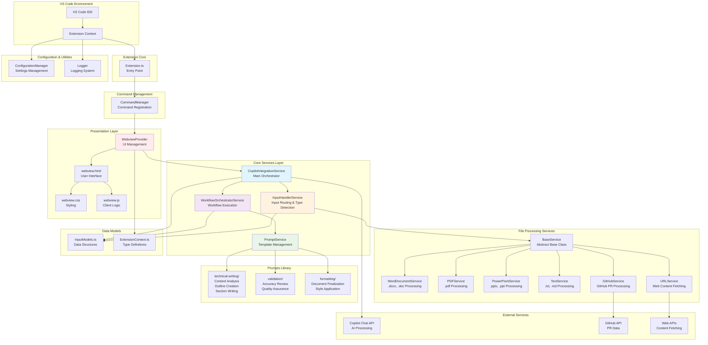

# VSCode WebView Extension - Architecture Overview

## System Architecture

This extension implements a sophisticated document processing and technical writing workflow system with clear separation of concerns and modular design.



## Architecture Principles

### 1. **Separation of Concerns**
- **Presentation Layer**: WebView handles UI and user interactions
- **Service Layer**: Business logic separated into focused services
- **Data Layer**: Clear data models and type definitions

### 2. **Modular Design**
- Each service has a single responsibility
- Services are loosely coupled and highly cohesive
- Easy to test, maintain, and extend

### 3. **Lazy Loading**
- Services are instantiated only when needed
- Improves extension activation performance
- Reduces memory footprint

### 4. **Template-Based Workflows**
- Prompts are externalized into template files
- Workflows are configurable and reusable
- Easy to modify without code changes

## Key Components

### Core Services

| Service | Responsibility | Key Features |
|---------|---------------|--------------|
| `CopilotIntegrationService` | Main orchestrator for Copilot interactions | Workflow execution, content combination |
| `InputHandlerService` | Input type detection and routing | Dynamic service loading, type inference |
| `WorkflowOrchestratorService` | Deterministic workflow execution | Step management, dependency resolution |
| `PromptService` | Template management and rendering | Variable substitution, metadata extraction |

### File Processing Services

| Service | File Types | Key Features |
|---------|------------|--------------|
| `WordDocumentService` | .docx, .doc | mammoth.js integration, text extraction |
| `PDFService` | .pdf | pdf-parse integration, content extraction |
| `PowerPointService` | .pptx, .ppt | XML parsing, slide content extraction |
| `TextService` | .txt, .md | UTF-8 processing, markdown support |
| `URLService` | HTTP/HTTPS URLs | Web scraping, content fetching |
| `GitHubService` | GitHub PRs | API integration, PR data extraction |

### Prompts Library Structure

```
src/prompts/
├── technical-writing/
│   ├── analyze-content.md
│   ├── create-outline.md
│   └── write-section.md
├── validation/
│   └── review-accuracy.md
└── formatting/
    └── finalize-document.md
```

## Extension Lifecycle

1. **Activation**: Extension activates on command execution
2. **Initialization**: Services are registered and configured
3. **UI Creation**: WebView panel is created when requested
4. **User Interaction**: Files are selected and goals are defined
5. **Processing**: Workflow execution begins
6. **Output**: Final document is generated and displayed

## Design Patterns Used

- **Service Locator**: Central service registry
- **Template Method**: Base service class with common behavior
- **Strategy Pattern**: Different processing strategies for file types
- **Observer Pattern**: Progress callbacks for workflow steps
- **Factory Pattern**: Dynamic service instantiation
- **Command Pattern**: VS Code command handling

## Error Handling Strategy

- **Graceful Degradation**: Failed steps don't break entire workflow
- **Comprehensive Logging**: All errors are logged with context
- **User Feedback**: Clear error messages in the UI
- **Recovery Options**: Users can retry failed operations

## Performance Considerations

- **Lazy Loading**: Services loaded on demand
- **Streaming Processing**: Large files processed in chunks
- **Caching**: Processed content cached for reuse
- **Timeout Handling**: Network requests have appropriate timeouts
- **Memory Management**: Buffers released after processing
