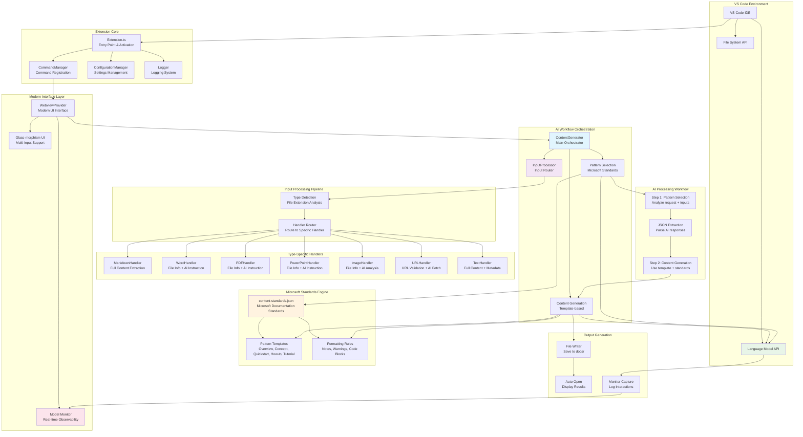
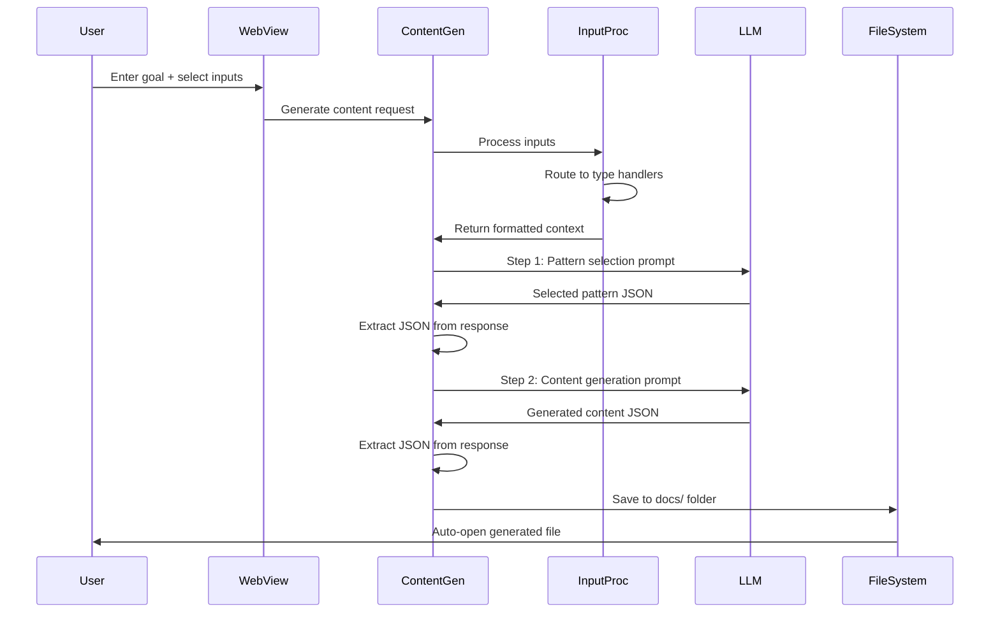
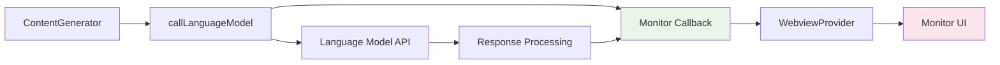

# AI Content Developer - Modern Architecture Overview

## System Architecture

This extension implements a streamlined AI-powered technical documentation creation system using VS Code's Language Model API with intelligent 2-step workflow orchestration and Microsoft standards compliance.


```mermaid
graph TB
    subgraph "VS Code Environment"
        VSCode[VS Code IDE]
        LangModelAPI[Language Model API]
        FileSystem[File System API]
        VSCode --> LangModelAPI
        VSCode --> FileSystem
    end

    subgraph "Extension Core"
        Extension[Extension.ts<br/>Entry Point & Activation]
        CommandMgr[CommandManager<br/>Command Registration]
        Config[ConfigurationManager<br/>Settings Management]
        Logger[Logger<br/>Logging System]
        
        VSCode --> Extension
        Extension --> CommandMgr
        Extension --> Config
        Extension --> Logger
    end

    subgraph "Modern Interface Layer"
        WebviewProvider[WebviewProvider<br/>Modern UI Interface]
        WebviewUI[Glass-morphism UI<br/>Multi-input Support]
        MonitorUI[Model Monitor<br/>Real-time Observability]
        
        CommandMgr --> WebviewProvider
        WebviewProvider --> WebviewUI
        WebviewProvider --> MonitorUI
    end

    subgraph "AI Workflow Orchestration"
        ContentGenerator[ContentGenerator<br/>Main Orchestrator]
        InputProcessor[InputProcessor<br/>Input Router]
        PatternSelector[Pattern Selection<br/>Microsoft Standards]
        ContentCreator[Content Generation<br/>Template-based]
        
        WebviewProvider --> ContentGenerator
        ContentGenerator --> InputProcessor
        ContentGenerator --> PatternSelector
        ContentGenerator --> ContentCreator
        ContentCreator --> LangModelAPI
        PatternSelector --> LangModelAPI
    end

    subgraph "Input Processing Pipeline"
        TypeDetection[Type Detection<br/>File Extension Analysis]
        HandlerRouter[Handler Router<br/>Route to Specific Handler]
        
        InputProcessor --> TypeDetection
        TypeDetection --> HandlerRouter
    end

    subgraph "Type-Specific Handlers"
        MarkdownHandler[MarkdownHandler<br/>Full Content Extraction]
        WordHandler[WordHandler<br/>File Info + AI Instruction]
        PDFHandler[PDFHandler<br/>File Info + AI Instruction]
        PowerPointHandler[PowerPointHandler<br/>File Info + AI Instruction]
        ImageHandler[ImageHandler<br/>File Info + AI Analysis]
        URLHandler[URLHandler<br/>URL Validation + AI Fetch]
        TextHandler[TextHandler<br/>Full Content + Metadata]
        
        HandlerRouter --> MarkdownHandler
        HandlerRouter --> WordHandler
        HandlerRouter --> PDFHandler
        HandlerRouter --> PowerPointHandler
        HandlerRouter --> ImageHandler
        HandlerRouter --> URLHandler
        HandlerRouter --> TextHandler
    end

    subgraph "AI Processing Workflow"
        Step1[Step 1: Pattern Selection<br/>Analyze request + inputs]
        Step2[Step 2: Content Generation<br/>Use template + standards]
        JSONExtract[JSON Extraction<br/>Parse AI responses]
        
        PatternSelector --> Step1
        Step1 --> JSONExtract
        JSONExtract --> Step2
        Step2 --> ContentCreator
    end

    subgraph "Microsoft Standards Engine"
        ContentStandards[content-standards.json<br/>Microsoft Documentation Standards]
        PatternTemplates[Pattern Templates<br/>Overview, Concept, Quickstart, How-to, Tutorial]
        FormattingRules[Formatting Rules<br/>Notes, Warnings, Code Blocks]
        
        ContentStandards --> PatternTemplates
        ContentStandards --> FormattingRules
        PatternSelector --> ContentStandards
        ContentCreator --> PatternTemplates
        ContentCreator --> FormattingRules
    end

    subgraph "Output Generation"
        FileWriter[File Writer<br/>Save to docs/]
        AutoOpen[Auto Open<br/>Display Results]
        Monitor[Monitor Capture<br/>Log Interactions]
        
        ContentCreator --> FileWriter
        FileWriter --> AutoOpen
        LangModelAPI --> Monitor
        Monitor --> MonitorUI
    end

    style ContentGenerator fill:#e1f5fe
    style InputProcessor fill:#f3e5f5
    style LangModelAPI fill:#e8f5e8
    style ContentStandards fill:#fff3e0
    style MonitorUI fill:#fce4ec
```

## Core Components

### Extension Architecture

| Component | Responsibility | Key Features |
|-----------|---------------|--------------|
| `ContentGenerator` | Main AI workflow orchestrator | 2-step process, JSON extraction, model monitoring |
| `InputProcessor` | Input routing and processing | Type detection, handler routing, metadata extraction |
| `WebviewProvider` | Modern UI and user interaction | Glass-morphism design, multi-input, real-time monitoring |
| `Handler Services` | Type-specific content processing | Dedicated processors for each input type |

### Input Processing Services

| Service | File Types | Key Features |
|---------|------------|--------------|
| `MarkdownHandler` | .md, .markdown | Full content extraction, heading analysis, code block detection |
| `WordHandler` | .docx, .doc | File metadata extraction, AI processing instruction |
| `PDFHandler` | .pdf | File metadata extraction, AI processing instruction |
| `PowerPointHandler` | .pptx, .ppt | File metadata extraction, AI processing instruction |
| `ImageHandler` | .png, .jpg, .jpeg, .gif, .svg, .webp | File metadata, AI visual analysis instruction |
| `URLHandler` | HTTP/HTTPS URLs | URL validation, domain extraction, AI fetch instruction |
| `TextHandler` | .txt, .log, .config | Full content extraction, word/line count analysis |

## AI Workflow Orchestration

### 2-Step Process


```mermaid
sequenceDiagram
    participant User
    participant WebView
    participant ContentGen
    participant InputProc
    participant LLM
    participant FileSystem

    User->>WebView: Enter goal + select inputs
    WebView->>ContentGen: Generate content request
    ContentGen->>InputProc: Process inputs
    InputProc->>InputProc: Route to type handlers
    InputProc->>ContentGen: Return formatted context
    
    ContentGen->>LLM: Step 1: Pattern selection prompt
    LLM->>ContentGen: Selected pattern JSON
    ContentGen->>ContentGen: Extract JSON from response
    
    ContentGen->>LLM: Step 2: Content generation prompt
    LLM->>ContentGen: Generated content JSON
    ContentGen->>ContentGen: Extract JSON from response
    
    ContentGen->>FileSystem: Save to docs/ folder
    FileSystem->>User: Auto-open generated file
```

### Pattern Selection Process

The AI analyzes the user's content request and available input materials to select from 5 Microsoft documentation patterns:

1. **Analysis Phase**: Examines user intent, time investment, content depth, audience level
2. **Pattern Matching**: Compares request against pattern purposes and descriptions
3. **Decision Output**: Returns selected pattern with reasoning and alternatives

### Content Generation Process

Using the selected pattern, the AI generates professional documentation:

1. **Template Application**: Uses the exact Microsoft markdown template for the pattern
2. **Placeholder Replacement**: Replaces template variables with actual content
3. **Standards Compliance**: Applies core guidelines, formatting elements, and customer intent
4. **Quality Assurance**: Ensures professional tone and technical accuracy

## Microsoft Standards Integration

### Content Standards Structure
```json
{
  "contentTypes": [
    {
      "id": "quickstart",
      "name": "Quickstart",
      "purpose": "Get service/technology into hands of new customers in less than 10 minutes",
      "markdownTemplate": "---\ntitle: [Follow SEO guidance...]\n# Quickstart: [verb] * [noun]\n...",
      "requiredSections": ["Introduction", "Prerequisites", "Procedure", "Validation", "Cleanup", "Next Steps"],
      "frontMatter": { "title": "Quickstart: Create X using Y", "ms.topic": "quickstart" }
    }
  ],
  "coreGuidelines": ["Follow patterns exactly", "Maintain section structure", ...],
  "formattingElements": [{"name": "Note", "format": "> [!NOTE]\n> Important information."}, ...]
}
```

### Template Processing
1. **Pattern Selection**: AI chooses appropriate pattern based on user request
2. **Template Retrieval**: System fetches the exact Microsoft markdown template
3. **Variable Substitution**: AI replaces placeholders with actual content
4. **Standards Application**: System applies formatting rules and guidelines
5. **Quality Validation**: Ensures output meets Microsoft documentation requirements

## Model Communication Monitor

### Real-Time Observability
The extension provides complete transparency into AI interactions:


```mermaid
graph LR
    A[ContentGenerator] --> B[callLanguageModel]
    B --> C[Monitor Callback]
    C --> D[WebviewProvider]
    D --> E[Monitor UI]
    
    B --> F[Language Model API]
    F --> G[Response Processing]
    G --> C
    
    style C fill:#e8f5e8
    style E fill:#fce4ec
```

### Monitor Features
- **Prompt Logging**: Captures exact prompts with timestamps
- **Response Logging**: Records complete AI responses
- **Step Identification**: Labels each interaction (pattern-selection, content-generation)
- **Export Functionality**: Download monitor data as JSON for analysis
- **Copy Operations**: One-click copy for prompts and responses

## Error Handling & Resilience

### JSON Response Processing
The extension handles various AI response formats:
- **Markdown code blocks**: Extracts JSON from ```json``` blocks
- **Mixed text responses**: Finds JSON within explanatory text
- **Malformed responses**: Provides detailed error logging
- **Empty responses**: Graceful failure with user feedback

### Input Processing Resilience
- **File access errors**: Graceful degradation with error reporting
- **URL validation**: Comprehensive validation before processing
- **Type detection**: Fallback to generic text handler for unknown types
- **Memory management**: Efficient processing of large files

## Performance Optimizations

### Context Optimization
- **Reduced token usage**: 60% reduction in context size through focused variable replacement
- **Efficient routing**: Type-specific handlers avoid unnecessary processing
- **Lazy loading**: Handlers initialized only when needed
- **Memory efficiency**: Streaming responses and garbage collection

### User Experience
- **Real-time feedback**: Immediate status updates during processing
- **Progressive enhancement**: UI works with and without JavaScript
- **Responsive design**: Optimized for all screen sizes
- **Accessibility**: Proper focus management and keyboard navigation

---

This architecture enables the creation of professional, Microsoft-standard documentation through an intuitive interface backed by robust AI workflow orchestration and comprehensive input processing capabilities.