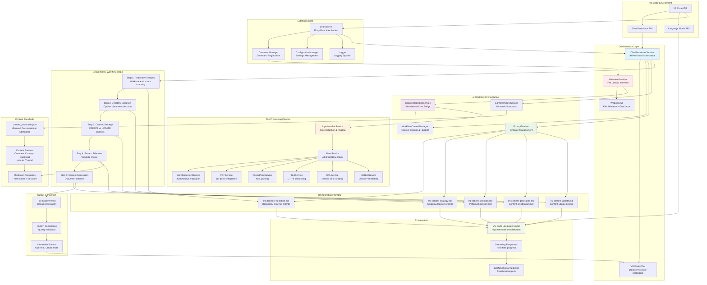

# AI Content Developer - Architecture Overview

## System Architecture

This extension implements a sophisticated AI-powered technical documentation creation system using VS Code's Chat Participant API with sequential workflow orchestration and intelligent content generation.


```mermaid
graph TB
    subgraph "VS Code Environment"
        VSCode[VS Code IDE]
        ChatAPI[Chat Participant API]
        LangModel[Language Model API]
        VSCode --> ChatAPI
        VSCode --> LangModel
    end

    subgraph "Extension Core"
        Extension[Extension.ts<br/>Entry Point & Activation]
        CommandMgr[CommandManager<br/>Command Registration]
        Config[ConfigurationManager<br/>Settings Management]
        Logger[Logger<br/>Logging System]
        
        VSCode --> Extension
        Extension --> CommandMgr
        Extension --> Config
        Extension --> Logger
    end

    subgraph "Dual Interface Layer"
        WebviewProvider[WebviewProvider<br/>File Upload Interface]
        ChatParticipant[ChatParticipantService<br/>AI Workflow Orchestrator]
        WebviewUI[Webview UI<br/>File Selection + Goal Input]
        ChatUI[VS Code Chat<br/>@content-creator participant]
        
        CommandMgr --> WebviewProvider
        Extension --> ChatParticipant
        WebviewProvider --> WebviewUI
        ChatParticipant --> ChatUI
        ChatAPI --> ChatParticipant
    end

    subgraph "AI Workflow Orchestration"
        CopilotIntegration[CopilotIntegrationService<br/>Webview-to-Chat Bridge]
        ContextManager[WorkflowContextManager<br/>Context Storage & Handoff]
        PromptService[PromptService<br/>Template Management]
        PatternService[ContentPatternService<br/>Microsoft Standards]
        
        WebviewProvider --> CopilotIntegration
        CopilotIntegration --> ContextManager
        ChatParticipant --> ContextManager
        ChatParticipant --> PromptService
        ChatParticipant --> PatternService
    end

    subgraph "File Processing Pipeline"
        InputHandler[InputHandlerService<br/>Type Detection & Routing]
        BaseService[BaseService<br/>Abstract Base Class]
        WordService[WordDocumentService<br/>mammoth.js integration]
        PDFService[PDFService<br/>pdf-parse integration]
        PPTService[PowerPointService<br/>XML parsing]
        TextService[TextService<br/>UTF-8 processing]
        URLService[URLService<br/>cheerio web scraping]
        GitHubService[GitHubService<br/>Octokit PR fetching]
        
        CopilotIntegration --> InputHandler
        InputHandler --> BaseService
        BaseService --> WordService
        BaseService --> PDFService
        BaseService --> PPTService
        BaseService --> TextService
        BaseService --> URLService
        BaseService --> GitHubService
    end

    subgraph "Sequential AI Workflow Steps"
        Step1[Step 1: Repository Analysis<br/>Workspace structure scanning]
        Step2[Step 2: Directory Selection<br/>Optimal placement decision]
        Step3[Step 3: Content Strategy<br/>CREATE vs UPDATE analysis]
        Step4[Step 4: Pattern Selection<br/>Template choice]
        Step5[Step 5: Content Generation<br/>Document creation]
        
        ChatParticipant --> Step1
        Step1 --> Step2
        Step2 --> Step3
        Step3 --> Step4
        Step4 --> Step5
    end

    subgraph "Orchestration Prompts"
        Prompt1[01-directory-selection.md<br/>Repository analysis prompt]
        Prompt2[02-content-strategy.md<br/>Strategy decision prompt]
        Prompt3[03-pattern-selection.md<br/>Pattern choice prompt]
        Prompt4[04-content-generation.md<br/>Content creation prompt]
        Prompt5[05-content-update.md<br/>Content update prompt]
        
        Step1 --> Prompt1
        Step2 --> Prompt2
        Step3 --> Prompt3
        Step4 --> Prompt4
        Step5 --> Prompt5
        PromptService --> Prompt1
        PromptService --> Prompt2
        PromptService --> Prompt3
        PromptService --> Prompt4
        PromptService --> Prompt5
    end

    subgraph "AI Integration"
        LangModelAPI[VS Code Language Model<br/>request.model.sendRequest]
        StreamingResp[Streaming Responses<br/>Real-time progress]
        JSONExtract[JSON Schema Validation<br/>Structured outputs]
        
        Prompt1 --> LangModelAPI
        Prompt2 --> LangModelAPI
        Prompt3 --> LangModelAPI
        Prompt4 --> LangModelAPI
        Prompt5 --> LangModelAPI
        LangModel --> LangModelAPI
        LangModelAPI --> StreamingResp
        StreamingResp --> JSONExtract
    end

    subgraph "Content Standards"
        ContentStandards[content_standards.json<br/>Microsoft Documentation Standards]
        Patterns[Content Patterns<br/>Overview, Concept, Quickstart<br/>How-to, Tutorial]
        Templates[Markdown Templates<br/>Front matter + Structure]
        
        PatternService --> ContentStandards
        ContentStandards --> Patterns
        Patterns --> Templates
        Step4 --> Templates
    end

    subgraph "Output Generation"
        FileCreation[File System Write<br/>Document creation]
        ContentValidation[Pattern Compliance<br/>Quality validation]
        UserFeedback[Interactive Buttons<br/>Open file, Create more]
        
        Step5 --> FileCreation
        FileCreation --> ContentValidation
        ContentValidation --> UserFeedback
        UserFeedback --> ChatUI
    end

    style ChatParticipant fill:#e1f5fe
    style CopilotIntegration fill:#f3e5f5
    style PromptService fill:#e8f5e8
    style InputHandler fill:#fff3e0
    style WebviewProvider fill:#ffebee
    style LangModelAPI fill:#f1f8e9
```

## Architecture Principles

### 1. **Dual Interface Design**
- **Webview Interface**: File upload and content request submission
- **Chat Participant Interface**: AI-powered sequential workflow execution
- **Seamless Handoff**: Context preservation between interfaces

### 2. **Sequential AI Orchestration**
- **Deterministic Workflow**: 5-step process with structured outputs
- **Language Model Integration**: Direct VS Code API usage via `request.model.sendRequest()`
- **Streaming Progress**: Real-time updates during AI processing
- **JSON Schema Validation**: Consistent, reliable AI responses

### 3. **Context Management**
- **Temporary Storage**: 30-minute TTL context preservation
- **Unique Identifiers**: nanoid-generated context IDs
- **Automatic Cleanup**: Periodic removal of expired contexts
- **Handoff Protocol**: Structured webview-to-chat transition

### 4. **Microsoft Standards Compliance**
- **Content Patterns**: Official documentation templates
- **Structured Output**: Enforced front matter and section ordering
- **Quality Validation**: Pattern compliance checking
- **Professional Formatting**: Microsoft documentation guidelines

## Key Components

### AI Workflow Services

| Service | Responsibility | Key Features |
|---------|---------------|--------------|
| `ChatParticipantService` | Main AI workflow orchestrator | Sequential step execution, Language Model API integration, streaming responses |
| `CopilotIntegrationService` | Webview-to-chat bridge | Context handoff, file processing coordination, chat participant launching |
| `WorkflowContextManager` | Context storage and retrieval | 30-minute TTL, unique ID generation, automatic cleanup |
| `PromptService` | AI prompt template management | Variable substitution, template loading, metadata extraction |
| `ContentPatternService` | Microsoft documentation standards | Pattern validation, template enforcement, content structuring |

### File Processing Services

| Service | File Types | Key Features |
|---------|------------|--------------|
| `WordDocumentService` | .docx, .doc | mammoth.js integration, text extraction, metadata preservation |
| `PDFService` | .pdf | pdf-parse integration, content extraction, page handling |
| `PowerPointService` | .pptx, .ppt | XML parsing, slide content extraction, presentation structure |
| `TextService` | .txt, .md | UTF-8 processing, markdown support, direct file reading |
| `URLService` | HTTP/HTTPS URLs | cheerio web scraping, content cleaning, timeout handling |
| `GitHubService` | GitHub PRs | Octokit API integration, PR data extraction, diff analysis |

### Sequential Orchestration Prompts

```
src/prompts/orchestration/
├── 01-directory-selection.md     # Repository analysis & optimal directory selection
├── 02-content-strategy.md        # CREATE vs UPDATE decision with overlap analysis
├── 03-pattern-selection.md       # Microsoft documentation pattern selection
├── 04-content-generation.md      # Professional content creation
└── 05-content-update.md         # Existing content enhancement
```

### Content Standards Integration

```
src/content-standards/
└── content_standards.json        # Microsoft documentation standards
    ├── contentTypes[]            # Overview, Concept, Quickstart, How-to, Tutorial
    ├── requiredFrontMatter[]     # Mandatory metadata fields
    ├── formattingElements[]      # Note, Warning, Tip, Image, Link formats
    └── sectionPlacementGuidelines[] # Structural requirements
```

## AI Workflow Lifecycle

1. **Extension Activation**: Extension activates and registers chat participant
2. **Service Initialization**: Core services configured with lazy loading
3. **Webview Interface**: User uploads files and defines content goals
4. **Context Storage**: Processed content stored with unique context ID
5. **Chat Participant Launch**: Automatic handoff to @content-creator in VS Code Chat
6. **Sequential AI Workflow**: 5-step deterministic process executes
7. **Document Generation**: Professional content created following Microsoft standards
8. **Context Cleanup**: Automatic removal of expired contexts

## Design Patterns Used

- **Chat Participant Pattern**: Official VS Code API for AI integration
- **Sequential Orchestration**: Step-by-step AI workflow with dependencies
- **Context Handoff Pattern**: Seamless webview-to-chat transition
- **Template Method**: Base service class with common processing behavior
- **Strategy Pattern**: Different processing strategies for file types
- **Observer Pattern**: Real-time progress streaming to user interface
- **Factory Pattern**: Dynamic service instantiation with lazy loading
- **Schema Validation**: Structured JSON outputs from AI responses

## AI Integration Strategy

- **Language Model API**: Direct integration with VS Code's Language Model API
- **Streaming Responses**: Real-time progress updates via `stream.progress()` and `stream.markdown()`
- **Structured Prompts**: Template-based prompts with variable substitution
- **JSON Schema Enforcement**: Validated outputs ensure consistent AI behavior
- **Error Recovery**: Graceful handling of AI processing failures

## Performance Considerations

- **Lazy Service Loading**: File processing services loaded only when needed
- **Context TTL Management**: 30-minute automatic cleanup prevents memory leaks
- **Streaming AI Responses**: Progressive content delivery for better UX
- **Timeout Handling**: Appropriate limits for AI model requests and file processing
- **Memory Efficiency**: Proper cleanup of processed content and temporary contexts
