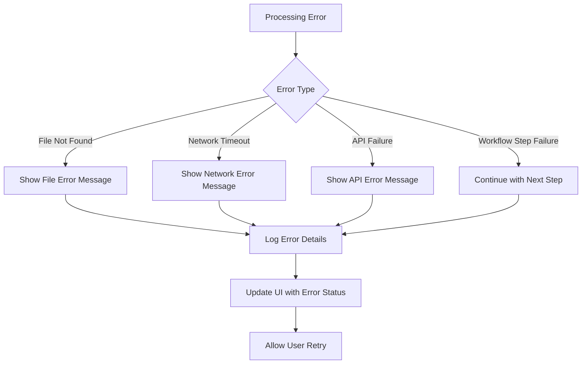

# VSCode WebView Extension - Data Flow Documentation

## Complete Data Flow Architecture

This document illustrates how data flows through the extension from user input to final output, showing the journey of information through various processing stages.

```mermaid
graph TD
    subgraph "User Interface Layer"
        UI[User Interface<br/>webview.html]
        UserFiles[File Selection<br/>Word, PDF, PPT, etc.]
        UserURL[URL Input<br/>https://example.com/doc.pdf]
        UserGitHub[GitHub PR<br/>github.com/org/repo/pull/123]
        UserGoal[User Goal<br/>"Create API documentation"]
        
        UserFiles --> UI
        UserURL --> UI
        UserGitHub --> UI
        UserGoal --> UI
    end

    subgraph "WebView Communication"
        UIEvents[UI Events<br/>Button Clicks, Form Submission]
        MsgSend[Message Sending<br/>postMessage()]
        MsgReceive[Message Receiving<br/>onDidReceiveMessage()]
        
        UI --> UIEvents
        UIEvents --> MsgSend
        MsgSend --> MsgReceive
    end

    subgraph "Extension Backend"
        WebViewProvider[WebviewProvider<br/>Message Handler]
        ProcessInputsMsg[PROCESS_INPUTS<br/>Message Type]
        ExecuteWorkflowMsg[EXECUTE_WORKFLOW<br/>Message Type]
        
        MsgReceive --> WebViewProvider
        WebViewProvider --> ProcessInputsMsg
        WebViewProvider --> ExecuteWorkflowMsg
    end

    subgraph "Input Processing Pipeline"
        CopilotSvc[CopilotIntegrationService<br/>Main Orchestrator]
        InputHandler[InputHandlerService<br/>Input Router]
        TypeDetection{Input Type<br/>Detection}
        
        ProcessInputsMsg --> CopilotSvc
        ExecuteWorkflowMsg --> CopilotSvc
        CopilotSvc --> InputHandler
        InputHandler --> TypeDetection
    end

    subgraph "File Type Routing"
        TypeDetection --> WordService[WordDocumentService<br/>.docx, .doc]
        TypeDetection --> PDFService[PDFService<br/>.pdf]
        TypeDetection --> PPTService[PowerPointService<br/>.pptx, .ppt]
        TypeDetection --> TextService[TextService<br/>.txt, .md]
        TypeDetection --> URLService[URLService<br/>HTTP/HTTPS]
        TypeDetection --> GitHubService[GitHubService<br/>GitHub PRs]
    end

    subgraph "Content Extraction"
        WordService --> WordContent[Word Content<br/>Text Extraction]
        PDFService --> PDFContent[PDF Content<br/>Text Parsing]
        PPTService --> PPTContent[PowerPoint Content<br/>Slide Text]
        TextService --> TextContent[Text Content<br/>File Reading]
        URLService --> URLContent[Web Content<br/>HTML Scraping]
        GitHubService --> GitHubContent[GitHub Content<br/>PR Details]
    end

    subgraph "Content Aggregation"
        ProcessedContent[ProcessedContent[]<br/>Standardized Format]
        ContentCombination[Content Combination<br/>Merge All Sources]
        
        WordContent --> ProcessedContent
        PDFContent --> ProcessedContent
        PPTContent --> ProcessedContent
        TextContent --> ProcessedContent
        URLContent --> ProcessedContent
        GitHubContent --> ProcessedContent
        
        ProcessedContent --> ContentCombination
    end

    subgraph "Workflow Orchestration"
        WorkflowOrch[WorkflowOrchestratorService<br/>Step Management]
        WorkflowDef[Workflow Definition<br/>technical-documentation]
        StepExecution[Step-by-Step Execution<br/>Analyze → Outline → Write → Review → Finalize]
        
        ContentCombination --> WorkflowOrch
        WorkflowOrch --> WorkflowDef
        WorkflowDef --> StepExecution
    end

    subgraph "Prompt System"
        PromptSvc[PromptService<br/>Template Manager]
        PromptTemplates[Prompt Templates<br/>Markdown Files]
        VariableSubstitution[Variable Substitution<br/>{{goal}}, {{content}}]
        RenderedPrompt[Rendered Prompt<br/>Complete Instructions]
        
        StepExecution --> PromptSvc
        PromptSvc --> PromptTemplates
        PromptTemplates --> VariableSubstitution
        VariableSubstitution --> RenderedPrompt
    end

    subgraph "AI Processing"
        CopilotAPI[Copilot Chat API<br/>OpenAI Integration]
        AIResponse[AI Response<br/>Generated Content]
        StepResult[Step Result<br/>Processed Output]
        
        RenderedPrompt --> CopilotAPI
        CopilotAPI --> AIResponse
        AIResponse --> StepResult
    end

    subgraph "Workflow Progress"
        StepComplete[Step Complete<br/>Store Result]
        NextStep{More Steps?}
        FinalResult[Final Document<br/>Complete Output]
        
        StepResult --> StepComplete
        StepComplete --> NextStep
        NextStep -->|Yes| StepExecution
        NextStep -->|No| FinalResult
    end

    subgraph "Response Communication"
        ProgressMsg[WORKFLOW_STEP_COMPLETE<br/>Progress Updates]
        FinalMsg[WORKFLOW_RESULT<br/>Final Output]
        UIUpdate[UI Update<br/>Display Results]
        
        StepComplete --> ProgressMsg
        FinalResult --> FinalMsg
        ProgressMsg --> UIUpdate
        FinalMsg --> UIUpdate
    end

    style CopilotSvc fill:#e1f5fe
    style WorkflowOrch fill:#f3e5f5
    style PromptSvc fill:#e8f5e8
    style InputHandler fill:#fff3e0
    style ProcessedContent fill:#ffebee
    style CopilotAPI fill:#f1f8e9
```

## Detailed Data Flow Steps

### 1. User Input Collection
```
User Actions → UI State → Message Creation
├── File Selection (VS Code file dialog)
├── URL Entry (text input)
├── GitHub PR URL (text input)
└── Goal Definition (textarea)
```

### 2. Message Communication
```
Frontend → Backend Communication
├── postMessage(PROCESS_INPUTS, payload)
├── onDidReceiveMessage(message)
└── Message routing to appropriate handler
```

### 3. Input Processing
```
Raw Inputs → Typed Inputs → Processed Content
├── Type Detection (URL patterns, file extensions)
├── Service Selection (lazy loading)
├── Content Extraction (service-specific logic)
└── Standardization (ProcessedContent format)
```

### 4. Workflow Execution
```
Content → Workflow → Steps → Results
├── Workflow Selection (technical-documentation)
├── Step Dependencies (analyze → outline → write...)
├── Prompt Rendering (variable substitution)
└── AI Processing (Copilot API calls)
```

### 5. Response Handling
```
AI Response → Processing → UI Update
├── Step Result Storage
├── Progress Notifications
├── Error Handling
└── Final Document Assembly
```

## Data Structures Flow

### Input Data Structure
```typescript
interface InputFile {
  uri: string;        // File path or URL
  name: string;       // Display name
  type: InputType;    // Detected or specified type
  content?: string;   // Pre-loaded content (optional)
}
```

### Processing Result Structure
```typescript
interface ProcessedContent {
  source: string;     // Original source identifier
  type: InputType;    // Content type
  text: string;       // Extracted text content
  metadata?: any;     // Additional context
}
```

### Workflow Context Structure
```typescript
interface WorkflowContext {
  goal: string;                           // User's objective
  processedContents: ProcessedContent[];  // All processed inputs
  stepOutputs: Map<string, string>;       // Results from each step
  currentStep: number;                    // Progress tracking
  totalSteps: number;                     // Total workflow steps
}
```

## Error Handling Flow



## Performance Optimization Flow

### Lazy Loading Strategy
```
Service Request → Check Cache → Load if Needed → Execute
├── InputHandlerService (always loaded)
├── File Services (loaded on demand)
├── WorkflowOrchestrator (loaded on first workflow)
└── PromptService (loaded with orchestrator)
```

### Content Processing Optimization
```
Large File → Stream Processing → Chunked Extraction → Memory Management
├── File Size Check (before processing)
├── Stream Reading (for large files)
├── Progressive Processing (yield control)
└── Buffer Cleanup (prevent memory leaks)
```

## Security Considerations in Data Flow

### Input Validation
```
User Input → Sanitization → Validation → Processing
├── URL validation (prevent malicious URLs)
├── File path validation (prevent path traversal)
├── Content size limits (prevent DoS)
└── Type validation (ensure expected formats)
```

### API Communication
```
Prompt Data → Sanitization → API Call → Response Validation
├── Remove sensitive information
├── Validate API responses
├── Handle rate limiting
└── Implement timeouts
```

This data flow ensures robust, secure, and efficient processing of user inputs while maintaining clear separation of concerns and providing excellent user experience through progress feedback and error handling.
