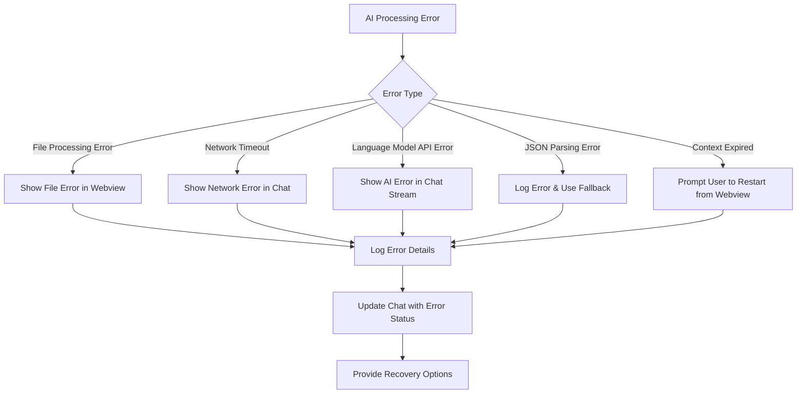

# AI Content Developer - Data Flow Documentation

## Complete AI Workflow Data Flow

This document illustrates how data flows through the AI Content Developer extension from user input via webview to AI-generated documentation, showing the journey through sequential orchestration and Chat Participant API integration.

```mermaid
graph TD
    subgraph "User Interface Layer"
        UI[User Interface<br/>webview.html]
        UserFiles[File Selection<br/>Word, PDF, PPT, etc.]
        UserURL[URL Input<br/>https://example.com/doc.pdf]
        UserGitHub[GitHub PR<br/>github.com/org/repo/pull/123]
        UserGoal[User Goal<br/>"Create API documentation"]
        
        UserFiles --> UI
        UserURL --> UI
        UserGitHub --> UI
        UserGoal --> UI
    end

    subgraph "WebView Communication"
        UIEvents[UI Events<br/>Button Clicks, Form Submission]
        MsgSend[Message Sending<br/>postMessage()]
        MsgReceive[Message Receiving<br/>onDidReceiveMessage()]
        
        UI --> UIEvents
        UIEvents --> MsgSend
        MsgSend --> MsgReceive
    end

    subgraph "Extension Backend"
        WebViewProvider[WebviewProvider<br/>Message Handler]
        ProcessInputsMsg[PROCESS_INPUTS<br/>Message Type]
        ExecuteWorkflowMsg[EXECUTE_WORKFLOW<br/>Message Type]
        
        MsgReceive --> WebViewProvider
        WebViewProvider --> ProcessInputsMsg
        WebViewProvider --> ExecuteWorkflowMsg
    end

    subgraph "Input Processing Pipeline"
        CopilotSvc[CopilotIntegrationService<br/>Main Orchestrator]
        InputHandler[InputHandlerService<br/>Input Router]
        TypeDetection{Input Type<br/>Detection}
        
        ProcessInputsMsg --> CopilotSvc
        ExecuteWorkflowMsg --> CopilotSvc
        CopilotSvc --> InputHandler
        InputHandler --> TypeDetection
    end

    subgraph "File Type Routing"
        TypeDetection --> WordService[WordDocumentService<br/>.docx, .doc]
        TypeDetection --> PDFService[PDFService<br/>.pdf]
        TypeDetection --> PPTService[PowerPointService<br/>.pptx, .ppt]
        TypeDetection --> TextService[TextService<br/>.txt, .md]
        TypeDetection --> URLService[URLService<br/>HTTP/HTTPS]
        TypeDetection --> GitHubService[GitHubService<br/>GitHub PRs]
    end

    subgraph "Content Extraction"
        WordService --> WordContent[Word Content<br/>Text Extraction]
        PDFService --> PDFContent[PDF Content<br/>Text Parsing]
        PPTService --> PPTContent[PowerPoint Content<br/>Slide Text]
        TextService --> TextContent[Text Content<br/>File Reading]
        URLService --> URLContent[Web Content<br/>HTML Scraping]
        GitHubService --> GitHubContent[GitHub Content<br/>PR Details]
    end

    subgraph "Content Aggregation"
        ProcessedContent[ProcessedContent[]<br/>Standardized Format]
        ContentCombination[Content Combination<br/>Merge All Sources]
        
        WordContent --> ProcessedContent
        PDFContent --> ProcessedContent
        PPTContent --> ProcessedContent
        TextContent --> ProcessedContent
        URLContent --> ProcessedContent
        GitHubContent --> ProcessedContent
        
        ProcessedContent --> ContentCombination
    end

    subgraph "Workflow Orchestration"
        WorkflowOrch[WorkflowOrchestratorService<br/>Step Management]
        WorkflowDef[Workflow Definition<br/>technical-documentation]
        StepExecution[Step-by-Step Execution<br/>Analyze → Outline → Write → Review → Finalize]
        
        ContentCombination --> WorkflowOrch
        WorkflowOrch --> WorkflowDef
        WorkflowDef --> StepExecution
    end

    subgraph "Prompt System"
        PromptSvc[PromptService<br/>Template Manager]
        PromptTemplates[Prompt Templates<br/>Markdown Files]
        VariableSubstitution[Variable Substitution<br/>{{goal}}, {{content}}]
        RenderedPrompt[Rendered Prompt<br/>Complete Instructions]
        
        StepExecution --> PromptSvc
        PromptSvc --> PromptTemplates
        PromptTemplates --> VariableSubstitution
        VariableSubstitution --> RenderedPrompt
    end

    subgraph "AI Processing"
        CopilotAPI[Copilot Chat API<br/>OpenAI Integration]
        AIResponse[AI Response<br/>Generated Content]
        StepResult[Step Result<br/>Processed Output]
        
        RenderedPrompt --> CopilotAPI
        CopilotAPI --> AIResponse
        AIResponse --> StepResult
    end

    subgraph "Workflow Progress"
        StepComplete[Step Complete<br/>Store Result]
        NextStep{More Steps?}
        FinalResult[Final Document<br/>Complete Output]
        
        StepResult --> StepComplete
        StepComplete --> NextStep
        NextStep -->|Yes| StepExecution
        NextStep -->|No| FinalResult
    end

    subgraph "Response Communication"
        ProgressMsg[WORKFLOW_STEP_COMPLETE<br/>Progress Updates]
        FinalMsg[WORKFLOW_RESULT<br/>Final Output]
        UIUpdate[UI Update<br/>Display Results]
        
        StepComplete --> ProgressMsg
        FinalResult --> FinalMsg
        ProgressMsg --> UIUpdate
        FinalMsg --> UIUpdate
    end

    style CopilotSvc fill:#e1f5fe
    style WorkflowOrch fill:#f3e5f5
    style PromptSvc fill:#e8f5e8
    style InputHandler fill:#fff3e0
    style ProcessedContent fill:#ffebee
    style CopilotAPI fill:#f1f8e9
```

## Detailed AI Workflow Data Flow Steps

### 1. User Input Collection (Webview Interface)
```
User Actions → UI State → Message Creation
├── File Selection (VS Code file dialog) - Word, PDF, PowerPoint, Text, URLs, GitHub PRs
├── Goal Definition (textarea) - "Create API documentation", "Write getting started guide"
├── Input Validation (client-side) - Ensure files and goal are provided
└── PROCESS_INPUTS Message - Triggers backend workflow
```

### 2. File Processing Pipeline
```
Raw Inputs → Type Detection → Service Routing → Content Extraction
├── InputHandlerService.detectInputType() - Analyzes file extensions and URL patterns
├── Lazy Service Loading - WordDocumentService, PDFService, etc. loaded on demand
├── Content Extraction - Service-specific processing (mammoth.js, pdf-parse, cheerio, etc.)
└── ProcessedContent[] - Standardized format with text and metadata
```

### 3. Context Handoff System
```
Processed Content → Context Storage → Chat Participant Launch
├── WorkflowContextManager.storeContext() - Creates unique context ID with 30-min TTL
├── Context Data - Goal, processed files, metadata stored temporarily
├── Chat Query Generation - "@content-creator context:${contextId}"
└── workbench.action.chat.open - Automatic VS Code Chat launch
```

### 4. Sequential AI Workflow Execution (Chat Participant)
```
Chat Request → Repository Analysis → 5-Step AI Orchestration
├── Step 1: Repository Structure Analysis - VS Code APIs scan workspace
├── Step 2: Directory Selection - AI chooses optimal content placement
├── Step 3: Content Strategy - AI decides CREATE vs UPDATE approach
├── Step 4: Pattern Selection - AI selects Microsoft documentation template
└── Step 5: Content Generation - AI creates professional documentation
```

### 5. Language Model API Integration
```
Prompt Templates → Variable Substitution → AI Processing → JSON Extraction
├── PromptService.renderPrompt() - Template variable substitution
├── request.model.sendRequest() - Direct Language Model API calls
├── Streaming Response Processing - Real-time progress via stream.progress()
└── JSON Schema Validation - Structured outputs ensure consistency
```

### 6. Document Creation & User Feedback
```
AI Response → File Writing → User Notification → Interactive Actions
├── File System Write - Document created in selected directory
├── Pattern Compliance Validation - Ensures Microsoft standards adherence
├── Chat Response with Buttons - "Open Created File", "Create More Content"
└── Context Cleanup - Automatic removal after successful completion
```

## Data Structures Flow

### Input Data Structure
```typescript
interface InputFile {
  uri: string;        // File path or URL
  name: string;       // Display name
  type: InputType;    // Detected or specified type
  content?: string;   // Pre-loaded content (optional)
}
```

### Processing Result Structure
```typescript
interface ProcessedContent {
  source: string;     // Original source identifier
  type: InputType;    // Content type
  text: string;       // Extracted text content
  metadata?: any;     // Additional context
}
```

### Workflow Context Structure
```typescript
interface WorkflowContext {
  contextId: string;                      // Unique context identifier
  timestamp: number;                      // Creation timestamp for TTL
  goal: string;                           // User's content objective
  processedFiles: ProcessedContent[];     // All processed input files
  originalInputs: InputFile[];            // Original file references
  options: { workspaceRoot?: string };    // Additional context options
  metadata: {                             // Extension metadata
    userAgent: string;
    vscodeVersion: string;
    extensionVersion: string;
  };
}
```

### AI Workflow Step Schemas
```typescript
interface DirectorySelectionSchema {
  selectedDirectory: string;              // Chosen directory path
  reasoning: string;                      // AI's selection reasoning
  confidence: number;                     // Confidence score (0.0-1.0)
  existingFiles: string[];                // Files in selected directory
  directoryPurpose: string;               // Purpose description
  alternativeOptions: Array<{             // Alternative directory options
    directory: string;
    reason: string;
  }>;
}

interface ContentStrategySchema {
  action: 'CREATE' | 'UPDATE';            // Strategy decision
  targetFile?: string;                    // File to update (if UPDATE)
  reasoning: string;                      // Strategy reasoning
  contentOverlap: number;                 // Overlap percentage (0-100)
  existingContentSummary?: string;        // Summary of existing content
  userJourneyContext: string;             // User journey context
}
```

## AI Workflow Error Handling


```mermaid
graph TD
    A[AI Processing Error] --> B{Error Type}
    B -->|File Processing Error| C[Show File Error in Webview]
    B -->|Network Timeout| D[Show Network Error in Chat]
    B -->|Language Model API Error| E[Show AI Error in Chat Stream]
    B -->|JSON Parsing Error| F[Log Error & Use Fallback]
    B -->|Context Expired| G[Prompt User to Restart from Webview]
    
    C --> H[Log Error Details]
    D --> H
    E --> H
    F --> H
    G --> H
    
    H --> I[Update Chat with Error Status]
    I --> J[Provide Recovery Options]
```

## Context Management Flow

### Context Lifecycle
```
Context Creation → Storage → Retrieval → Cleanup
├── nanoid(12) - Generate unique context ID
├── 30-minute TTL - Automatic expiration
├── Periodic Cleanup - Every 5 minutes check for expired contexts
└── Manual Removal - After successful workflow completion
```

### Context Handoff Protocol
```
Webview Request → Context Storage → Chat Launch → Context Retrieval
├── CopilotIntegrationService.createNewContent() - Initial processing
├── WorkflowContextManager.storeContext() - Temporary storage
├── Chat Query Generation - "@content-creator context:${contextId}"
└── ChatParticipantService.retrieveContext() - Context restoration
```

## AI Integration Performance

### Language Model API Optimization
```
Prompt Preparation → Streaming Request → Progressive Response → JSON Extraction
├── Template Rendering - Variable substitution in prompts
├── Streaming API Calls - Real-time progress updates
├── Fragment Processing - Progressive content delivery
└── Schema Validation - Structured output parsing
```

### Memory Management
```
File Processing → Context Storage → AI Processing → Cleanup
├── ProcessedContent Limit - Reasonable memory usage
├── Context TTL Management - 30-minute automatic cleanup
├── Stream Buffer Management - Progressive AI response handling
└── Service Disposal - Proper resource cleanup on deactivation
```

## Security Considerations in AI Workflow

### Input Sanitization
```
User Input → File Validation → Content Extraction → AI Processing
├── File Type Validation - Ensure supported formats
├── URL Validation - Prevent malicious URLs
├── Content Size Limits - 10MB max for URLs, reasonable file sizes
└── GitHub Token Security - Optional token storage in VS Code settings
```

### AI Response Validation
```
AI Response → JSON Extraction → Schema Validation → Content Application
├── JSON Format Validation - Ensure structured responses
├── Schema Compliance - Validate against expected data types
├── Content Sanitization - Remove any potentially harmful content
└── Pattern Enforcement - Ensure Microsoft documentation standards
```

This AI-powered data flow ensures robust, secure, and intelligent processing of user inputs while providing real-time feedback and maintaining deterministic, high-quality documentation generation through the Chat Participant API integration.
